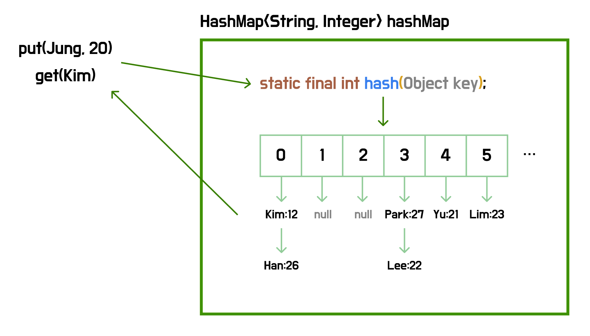

# HashMap


> **HashMap은 key-value 쌍으로 구성된 entry를 저장하며 해싱을 통해 빠른 검색을 지원하는 Map 자료구조이다.**

<br>

### 💡HashMap의 정의

먼저, **Map**은 **`key-value`** 쌍으로 데이터를 저장하며, **키**를 통해 값을 삽입하고 조회한다. **HashMap**은 여기서 한 단계 더 나아가, **키**를 **해시 함수**에 통과시켜 버킷의 위치를 계산하고, 해당 위치에 **엔트리**를 저장하는 방식으로 평균 O(1)의 검색 성능을 제공한다.



<br>

### 💡HashMap의 생성

```java
public static void main(String[] args) {
    // 크기를 지정하지 않고 선언
    HashMap<String, Integer> hashMap1 = new HashMap<>();

    // 크기를 지정하여 선언(공간 확장 비용 감소)
    HashMap<String, Integer> hashMap2 = new HashMap<>(30);

		// 기존 Collection의 원소들을 포함하여 선언
    HashMap<String, Integer> hashMap3 = new HashMap<>(hashMap2);
}
```

<br>

### 💡HashMap의 메서드

**원소 삽입과 삭제**

```java
// 원소 삽입
Integer v1 = hashMap1.put("Kim", 21);
Integer v2 = hashMap1.put("Choi", 24);

// 원소 삭제
Integer r1 = hashMap1.remove("Kims");
Integer r2 = hashMap1.remove("Choi");
```

<br>

**조회 관련**

```java
// 특정 Key의 Value 가져오기
Integer v3 = hashMap1.get("Kim");
Integer v4 = hashMap1.get("Choi");

// 크기 조회
int size = hashMap1.size();

// 비어있는지 조회
boolean isEmpty = hashMap1.isEmpty();

// 특정 키가 존재하는지 조회
boolean containsKey = hashMap1.containsKey("Kim");

// 특정 값이 존재하는지 조회
boolean containsValue = hashMap1.containsValue(21);
```

<br>

**기타**

```java
// 비우기
hashMap1.clear();
```

<br>

### 💡HashMap의 순회

**Map** 인터페이스는 `entrySet()`, `keySet()`, `values()`를 통해 내부 데이터를 조회할 수 있는 메서드를 제공하며, 이를 활용해 아래와 같이 순회할 수 있다.

```java
// Entry로 뽑아 Key, Value 순회
for (Map.Entry<String, Integer> entry : hashMap3.entrySet()) {
    System.out.println("entry = " + entry);
    System.out.println("entry.getKey() = " + entry.getKey());
    System.out.println("entry.getValue() = " + entry.getValue());
}

// Key만 뽑아 순회
for (String key : hashMap1.keySet()) {
    System.out.println("key = " + key);
}

// Value만 뽑아 순회
for (Integer value : hashMap1.values()) {
    System.out.println("value = " + value);
}
```