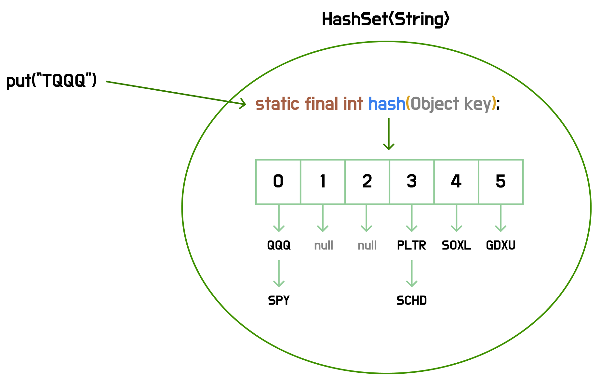

# HashSet


> **HashSet은 중복을 허용하지 않는 단일 값을 entry로 저장하며 해싱을 통해 빠른 검색을 지원하는 Set 자료구조이다.**

<br>

### 💡HashSet의 정의

**Set**은 중복을 허용하지 않는 컬렉션으로, 순서를 보장하지 않는다. **HashSet**은 원소를 해시 함수에 통과시켜 버킷의 위치를 계산하고, 해당 위치에 요소를 저장하는 방식으로 평균 O(1)의 검색, 삽입, 삭제 성능을 제공한다.



<br>

### 💡HashSet의 생성

```java
public static void main(String[] args) {
    HashSet<String> hashSet1 = new HashSet<>();

    // 기존 Collection의 원소들을 포함하여 선언
    HashSet<String> hashSet2 = new HashSet<>(hashSet1);
}
```

<br>

### 💡HashSet의 메서드

**원소 삽입과 삭제**

```java
// 원소 삽입(중복이면 false 반환)
boolean b1 = hashSet1.add("QQQ");
boolean b2 = hashSet1.add("SPY");

// 원소 삭제(삭제에 실패하면 false 반환)
boolean b3 = hashSet1.remove("QQQ");
```

<br>

**조회 관련**

```java
// 크기 조회
int size = hashSet1.size();

// 비어있는지 조회
boolean b4 = hashSet1.isEmpty();

// 특정 원소를 포함하고 있는지 조회
boolean b5 = hashSet1.contains("SPY");
```

<br>

**기타**

```java
// 비우기
hashSet1.clear();
```

<br>

### 💡HashSet의 순회

**HashSet**은 `Key-Value` 구조가 아니기 때문에 바로 순회가 가능하다.

```java
for (String s : hashSet1) {
    System.out.println("s = " + s);
}
```