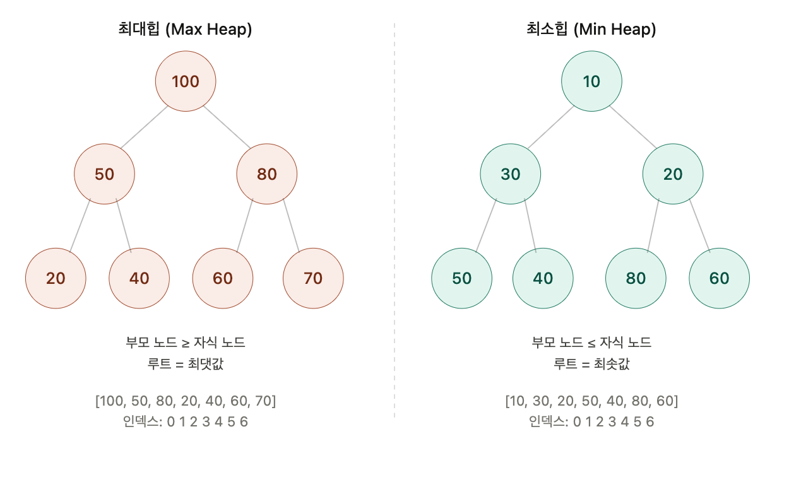
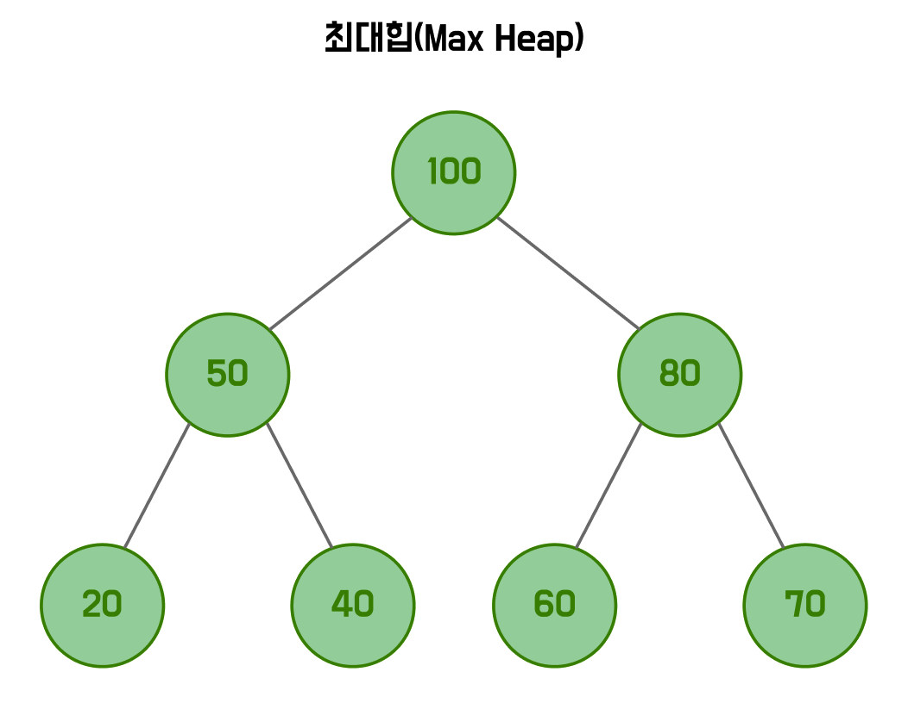
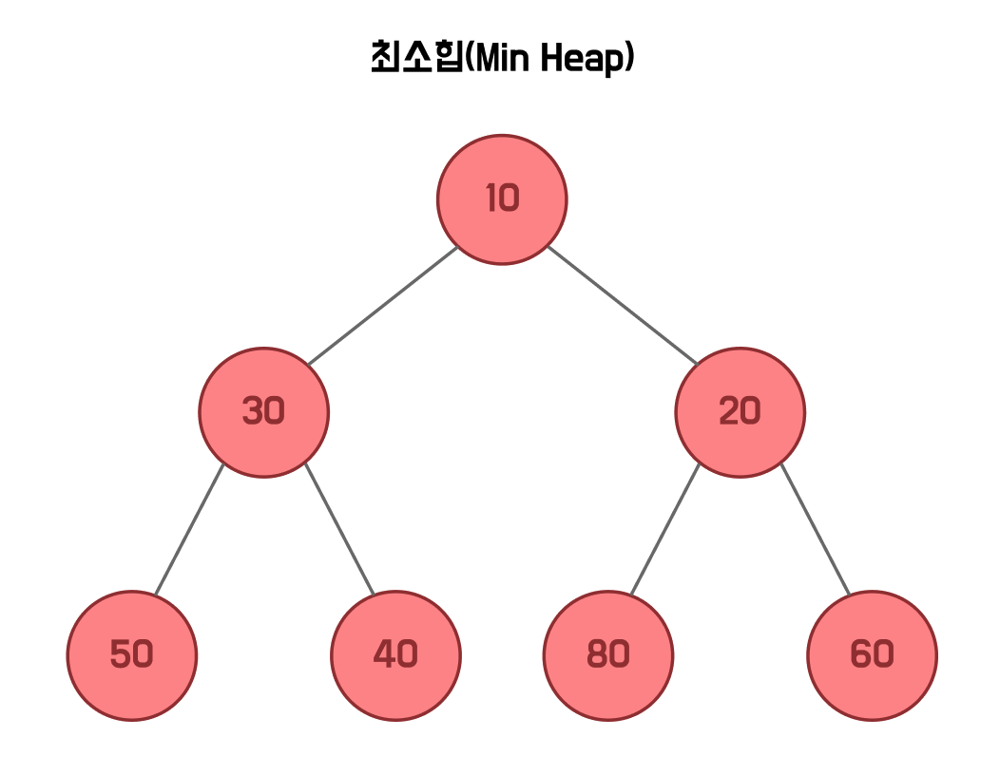

# 최소힙과 최대힙


<br>

### 💡힙(Heap)의 정의

**힙**은 **완전 이진 트리 기반**의 자료구조로, **부모-자식** 간의 우선순위 관계를 항상 유지한다. 최댓값 또는 최솟값을 O(1)에 조회하고, 삽입과 삭제를 O(log n)에 처리할 수 있다.



### 💡최대힙(Max Heap)

**최대힙**은 **부모 노드의 값**이 항상 자식 노드의 값보다 크거나 같은 힙이다. 루트 노드가 항상 **최댓값**을 가진다.



<br>

**💫최대힙 구현**

**Java**에서는 `PriorityQueue`라는 클래스를 제공하는데, **정렬 기준**을 내림차순으로 설정하면 최대힙으로 사용할 수 있다.

```java
public static void main(String[] args) {
    // Collections.reverseOrder()를 Comparator로 전달(내림차순)
    PriorityQueue<Integer> maxHeap = new PriorityQueue<>(Collections.reverseOrder());

    // 원소 추가
    boolean b1 = maxHeap.offer(10);
    boolean b2 = maxHeap.offer(20);
    boolean b3 = maxHeap.offer(30);

    // 원소 삭제
    Integer r1 = maxHeap.poll();

    // 최상위 원소 참조
    Integer r2 = maxHeap.peek();

    // 힙의 크기 조회
    int size = maxHeap.size();

    // 특정 원소 포함 여부 조회
    boolean b4 = maxHeap.contains(10);

    // 힙이 비어있는지 조회
    boolean b5 = maxHeap.isEmpty();

    // 힙 비우기
    maxHeap.clear();
}
```

<br>

### 💡최소힙(Max Heap)

**최소힙**은 **부모 노드의 값**이 항상 자식 노드의 값보다 작거나 같은 힙이다. 루트 노드가 항상 **최솟값**을 가진다.



<br>

**💫최소힙 구현**

최대힙과 반대로 `PriorityQueue`의 기본 동작이 최소힙이므로, 별도의 `Comparator` 없이 그대로 사용할 수 있다.

```java
public static void main(String[] args) {
    PriorityQueue<Integer> minHeap = new PriorityQueue<>();

    // 원소 추가
    boolean b6 = minHeap.offer(10);
    boolean b7 = minHeap.offer(20);
    boolean b8 = minHeap.offer(30);

    // 원소 삭제
    Integer r3 = minHeap.poll();

    // 최상위 원소 참조
    Integer r4 = minHeap.peek();

    // 힙의 크기 조회
    int size2 = minHeap.size();

    // 특정 원소 포함 여부 조회
    boolean b9 = minHeap.contains(10);

    // 힙이 비어있는지 조회
    boolean b10 = minHeap.isEmpty();

    // 힙 비우기
    minHeap.clear();
}
```

<br>

### 💡인덱스 관계

힙은 내부적으로 배열로 구현되며, 인덱스 간 다음 관계가 성립합니다.

| 관계 | 공식 |
|------|------|
| 부모 노드 인덱스 | `(i - 1) / 2` |
| 왼쪽 자식 인덱스 | `2 * i + 1` |
| 오른쪽 자식 인덱스 | `2 * i + 2` |