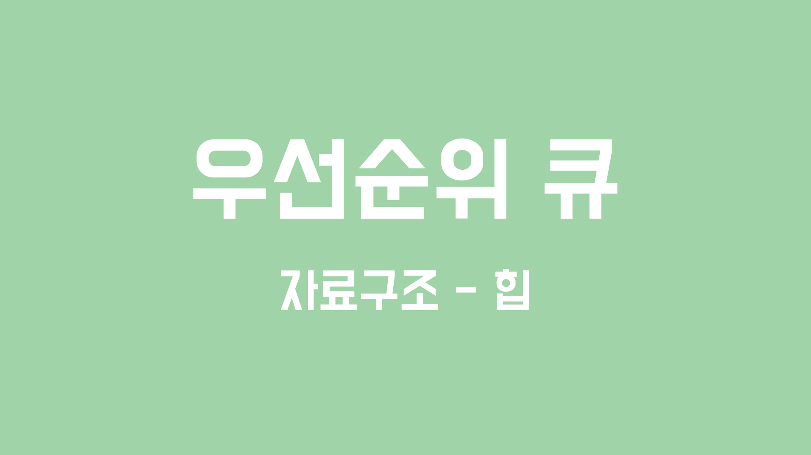

# 우선순위 큐



<br>

### 💡우선순위 큐 (Priority Queue)

**우선순위 큐**는 **힙** 기반의 자료구조로, 일반 큐와 달리 삽입 순서와 무관하게 우선순위가 높은 요소부터 꺼내진다.

‘*우선순위가 높다*’의 기준이 순위를 가리키는 수가 높다면 **최대힙**을, 반대로 순위를 가리키는 수가 낮다면 **최소힙**을 선택하자.

<br>

### 💡우선순위 큐 구현

**Java**의 `PriorityQueue`는 원소 삽입 시 내부적으로 `compareTo()`를 호출하여, 힙 구조를 유지한다. 따라서, **커스텀 클래스**를 사용하는 경우 `Comparable`을 구현하거나, `Comparator`을 전달해야 한다.

```java
public static void main(String[] args) {
    // 기본 오름차순 = 숫자가 낮을수록 우선순위가 높음
    PriorityQueue<Integer> priorityQueue = new PriorityQueue<>();

    // 원소 추가
    boolean b1 = priorityQueue.offer(50);
    boolean b2 = priorityQueue.offer(10);
    boolean b3 = priorityQueue.offer(30);

    // 루트 조회
    int r1 = priorityQueue.peek();

    // 루트 제거 및 반환
    int r2 = priorityQueue.poll();

    // 우선순위 큐의 크기 조회
    int size = priorityQueue.size();

    // 특정 원소 포함 여부 조회
    boolean contains = priorityQueue.contains(30);

    // 우선순위 큐가 비어있는지 조회
    boolean isEmpty = priorityQueue.isEmpty();

    // 우선순위 큐 비우기
    priorityQueue.clear();
}
```

<br>

**Comparable을 구현하는 경우**

```java
static class Student implements Comparable<Student> {
    String name;
    int score;
    int age;

    public Student(
            String name,
            int score,
            int age
    ) {
        this.name = name;
        this.score = score;
        this.age = age;
    }

    @Override
    public int compareTo(Student target) {
        if(this.score == target.score){
            return Integer.compare(this.age, target.age);
        }
        return Integer.compare(this.score, target.score);
    }
}

public static void main(String[] args) {
    PriorityQueue<Student> priorityQueue = new PriorityQueue<>();

    priorityQueue.offer(new Student("하하", 100, 30));
    priorityQueue.offer(new Student("길", 100, 31));
    priorityQueue.offer(new Student("노홍철", 90, 30));

    Student s1 = priorityQueue.poll(); // 노홍철
    Student s2 = priorityQueue.poll(); // 하하
    Student s3 = priorityQueue.poll(); // 길
}
```

<br>

**Comparator을 전달하는 경우**

```java
public static void main2(String[] args) {
    // 람다를 통한 익명함수 구현
    PriorityQueue<Student> priorityQueue = new PriorityQueue<>(
            (a, b) -> a.score != b.score
                    ? Integer.compare(a.score, b.score)
                    : Integer.compare(a.age, b.age)
    );
}
```