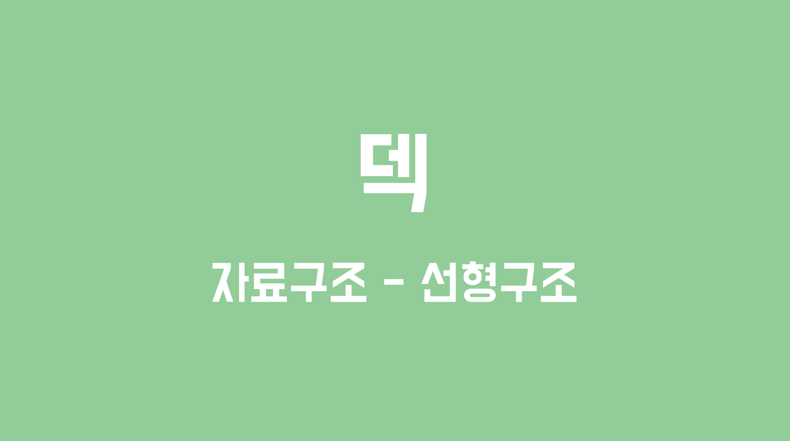
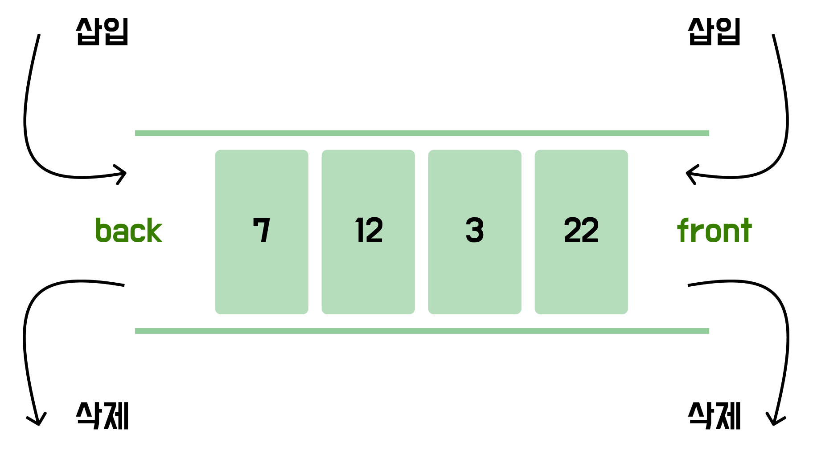

# 덱



> ***덱은 양쪽 입구로 삽입과 삭제를 수행할 수 있는 자료구조이다.***

<br>

### 💡덱의 정의

**덱**(Double Ended Queue, Deque)은 큐의 양쪽 입구에서 삽입과 삭제를 모두 수행할 수 있는 자료구조이다. 상황에 따라 스택으로, 큐로 활용할 수 있다.



<br>

### 💡덱의 생성

**Java**에서는 `Deque` 표준 명세가 존재하며, 일반적으로 가장 많이 사용되는 구현체는 `ArrayDeque`다. 이전 큐 포스팅에서 언급했듯이, `ArrayDeque`는 내부적으로 원형큐로 구현되어 있어 삽입과 삭제 연산이 빠르다.

```java
public static void main(String[] args) {
    Deque<Integer> deque = new ArrayDeque<>();

    // 원소 삽입
    deque.offerFirst(10);
    deque.offerFirst(20);

    System.out.println("deque = " + deque);

    // 원소 삭제
    deque.pollFirst();
    deque.pollFirst();

    System.out.println("deque = " + deque);

}
```

<br>

### 💡덱의 메서드

**삽입**

```java
// 앞에 원소 삽입
boolean r1 = deque.offerFirst(10);
boolean r2 = deque.offerFirst(20);

// 뒤에 원소 삽입
boolean r3 = deque.offerLast(30);
boolean r4 = deque.offerLast(40);

// 앞에 원소 삽입(실패 시 예외)
deque.addFirst(10);
deque.addFirst(20);

// 뒤에 원소 삽입(실패 시 예외)
deque.addLast(30);
deque.addLast(40);
```

<br>

**삭제**

```java
// 앞에 원소 삭제
Integer e1 = deque.pollFirst();

// 뒤에 원소 삭제
Integer e2 = deque.pollLast();

// 앞에 원소 삭제(실패 시 예외)
Integer e3 = deque.removeFirst();

// 뒤에 원소 삭제(실패 시 예외)
Integer e4 = deque.removeLast();
```

<br>

**조회**

```java
// 앞에 위치한 원소 조회
Integer e5 = deque.peekFirst();

// 뒤에 위치한 원소 조회
Integer e6 = deque.peekLast();

// 앞에 위치한 원소 조회(실패 시 예외)
Integer e7 = deque.getFirst();

// 뒤에 위치한 원소 조회(실패 시 예외)
Integer e8 = deque.getLast();
```

<br>

**기타**

```java
// 덱 크기
int size = deque.size();

// 덱 비우기
deque.clear();

// 특정 원소 포함 여부 확인
boolean contains = deque.contains(10);
```