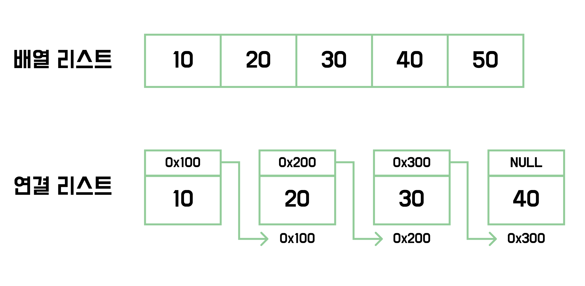
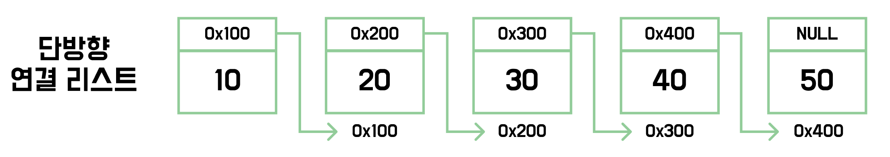
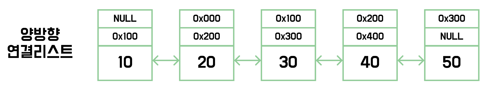
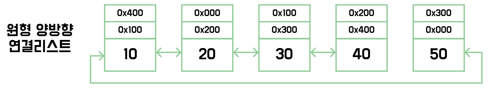

# 리스트


> ***리스트는 데이터를 순차적으로 일렬로 저장하는 자료구조이다.***

<br>

## 💡리스트의 정의

**리스트**(List)는 **선형 자료구조**의 한 종류로, 데이터를 순차적으로 저장할 수 있는 자료구조이다. 채택하는 구조에 따라, 배열 리스트와 연결 리스트로 구현할 수 있다.

<br>

## 💡배열 리스트

배열 기반으로 구현되어 메모리 상에서 데이터가 연속된 주소에 저장된다. **Java**에서는 `ArrayList` 클래스를 통해 이를 제공하며, 요소 추가 시 크기가 자동으로 늘어나는 **가변 크기 배열**이다.

<br>

**구현**

```java
public static void main(String[] args) {
    List<Integer> list = new ArrayList<>();

    // 마지막 인덱스에 원소 추가
    list.add(10);
    list.add(20);
    list.add(30);

    // 특정 인덱스에 원소 추가
    list.add(0, 40);

    // 특정 인덱스 원소 가져오기
    Integer value = list.get(0);

    // 특정 인덱스 원소 설정하기
    list.set(0, 50);

    // 특정 인덱스 원소 삭제하기
    list.remove(0);

    // 특정 원소 삭제하기
    list.remove(Integer.valueOf(50));

    // 원소 개수 반환
    int size = list.size();

    // 특정 원소 포함 여부 반환
    boolean contains = list.contains(20);

    // 특정 원소의 첫번째 인덱스 반환
    int i = list.indexOf(20);

    // 비어있는지 여부 확인
    boolean isEmpty = list.isEmpty();

    // 모든 원소 삭제
    list.clear();

    // 오름차순 정렬
    Collections.sort(list);
}
```

<br>

## 💡연결리스트



**연결 리스트**는 배열 리스트와 다르게, 각 노드가 **그 다음 노드의 주소를 참조**하여 연결되어 있다. **Java**에서는 `LinkedList` 클래스를 통해 구현할 수 있다.

<br>

연결 리스트는 크게 단방향 **연결 리스트**, **양방향 연결 리스트**, **원형 연결 리스트** 총 세종류로 나눌 수 있다. 순서대로 살펴보자.

<br>

### 💡단방향 연결 리스트



**단방향 연결 리스트**는 **다음 노드**를 가리키기 위한 **포인터 주소**를 갖고 있다. 따라서, 이전 노드에 접근할 방법이 없으며 처음부터 다시 순회해야 한다.

<br>

### 💡양방향 연결 리스트



**양방향 연결 리스트**는 **이전 노드**, **다음 노드** 각각을 가리키는 **포인터 주소**를 갖고 있다. 따라서, 추가의 순회 없이 이전 노드에 바로 접근할 수 있다.

<br>

### 💡원형 연결 리스트



**원형 양방향 연결리스트**는 **처음 노드**와 **마지막 노드**가 서로를 가리키게 해 순환 고리를 갖는 연결리스트이다.

<br>

### 💡연결 리스트 구현

**원소 추가**

```java
public static void main(String[] args) {
    LinkedList<String> linkedList = new LinkedList<>();

    // 맨 뒤에 원소 추가
    boolean a = linkedList.add("a");
    boolean b = linkedList.add("b");

    // 맨 앞에 원소 추가
    linkedList.addFirst("c");

    // 맨 뒤에 원소 추가
    linkedList.addLast("d");

    // 특정 위치에 원소 추가
    linkedList.add(0, "e");

    // 컬렉션 내의 원소 추가
    linkedList.addAll(List.of("f", "g", "h"));

    // 특정 위치에 컬랙션 내의 원소 추가
    linkedList.addAll(1, List.of("i", "j", "k"));
}
```

<br>

**원소 삭제**

```java
// 맨 앞의 원소 삭제
String s1 = linkedList.remove();

// 맨 앞의 원소 삭제
String s2 = linkedList.removeFirst();

// 맨 뒤의 원소 삭제
String s3 = linkedList.removeLast();

// 특정 위치 원소 삭제
String s4 = linkedList.remove(0);

// 컬렉션에 포함된 원소들을 삭제
boolean b1 = linkedList.removeAll(List.of("i", "j", "k"));

// 컬렉션에 포함된 원소들을 남기고 나머지 삭제
boolean b2 = linkedList.retainAll(List.of("i", "j", "k"));

// 모든 원소 삭제
linkedList.clear();
```

<br>

**상태 조회**

```java
// 리스트가 비어있는지 확인
boolean isEmpty = linkedList.isEmpty();

// 리스트 크기 조회
int size = linkedList.size();

// 값을 포함하는지 확인
boolean contains = linkedList.contains("a");

// 컬렉션을 포함하는지 확인
boolean containsAll = linkedList.containsAll(List.of("a", "b", "c", "d", "e", "f", "g", "h"));

// 값이 위치하는 첫번재 인덱스 조회
int i0 = linkedList.indexOf("a");

// 값이 위치하는 마지막 인덱스 조회
int i1 = linkedList.lastIndexOf("a");
```

<br>

**원소 조회**

```java
// 인덱스에 위치하는 원소 조회
String s = linkedList.get(10);

// 지정된 범위를 슬라이스
List<String> strings = linkedList.subList(0, 10);
```

<br>

**원소 변경**

```java
// 특정 위치의 원소 변경
String a1 = linkedList.set(0, "a");
```