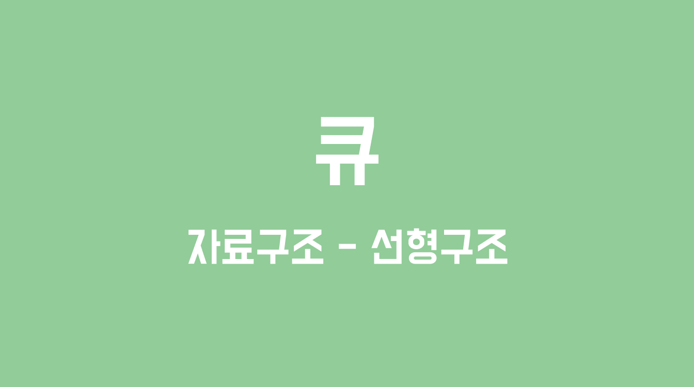
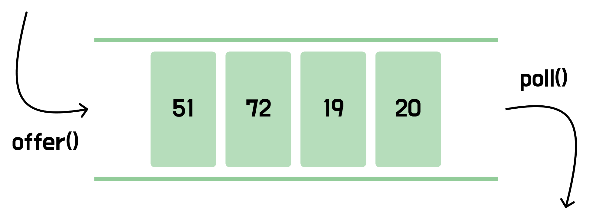

# 큐



> ***큐는 선입선출의 구조로 동작하는 자료구조이다.***

<br>

### 💡큐의 정의

**큐**(Queue)는 가장 먼저 들어온 원소가 가장 먼저 나가는 선입선출(First In First Out) 구조의 대표적인 자료구조이다. **스택**(Stack)과 대조적인 형태를 띄고 있다.



<br>

### 💡큐의 생성

**Java**에서는 표준 명세인 `Queue` 인터페이스가 있고, 대표적인 구현체로 `ArrayDeque`가 있다. `ArrayDeque`는 내부적으로 **원형 큐**(Circular Queue)로 구현되어 있어 앞뒤 삽입/삭제 모두 O(1)이다.

```java
public static void main(String[] args) {
    Queue<Integer> queue = new ArrayDeque<>();

    // 원소 삽입
    queue.offer(1);
    queue.offer(2);

    System.out.println("queue = " + queue);

    // 원소 꺼내기
    Integer e1 = queue.poll();
    Integer e2 = queue.poll();

    System.out.println("e1 = " + e1);
    System.out.println("e2 = " + e2);
}
```

<br>

### 💡큐의 메서드

**삽입과 삭제, 참조**

```java
// 원소 삽입
boolean r1 = queue.offer(3); // 성공 시 true 반환
boolean r2 = queue.offer(4); // 실패 시 false 반환

boolean r3 = queue.add(5); // 성공 시 true 반환
boolean r4 = queue.add(6); // 실패 시 예외 반환

// 원소 삭제
Integer p1 = queue.poll(); // 성공 시 삭제된 원소 반환
Integer p2 = queue.poll(); // 실패 시(큐가 비어있을 때) null 반환

Integer t3 = queue.remove(); // 성공 시 삭제된 원소 반환
Integer t4 = queue.remove(); // 실패 시(큐가 비어있을 때) 예외 반환

// 특정 원소 삭제
boolean r5 = queue.remove(1);

// 가장 앞에 있는 원소 참조
Integer e3 = queue.peek(); // 공백 큐이면 null 반환
Integer e4 = queue.element(); // 공백 큐이면 에외 반환
```

<br>

**기타**

```java
// 큐 크기 확인
int size = queue.size();

// 큐 비어있는지 확인
boolean empty = queue.isEmpty();

// 큐 초기화
queue.clear();

// 특정 원소 포함 확인
boolean contains = queue.contains(10);
```