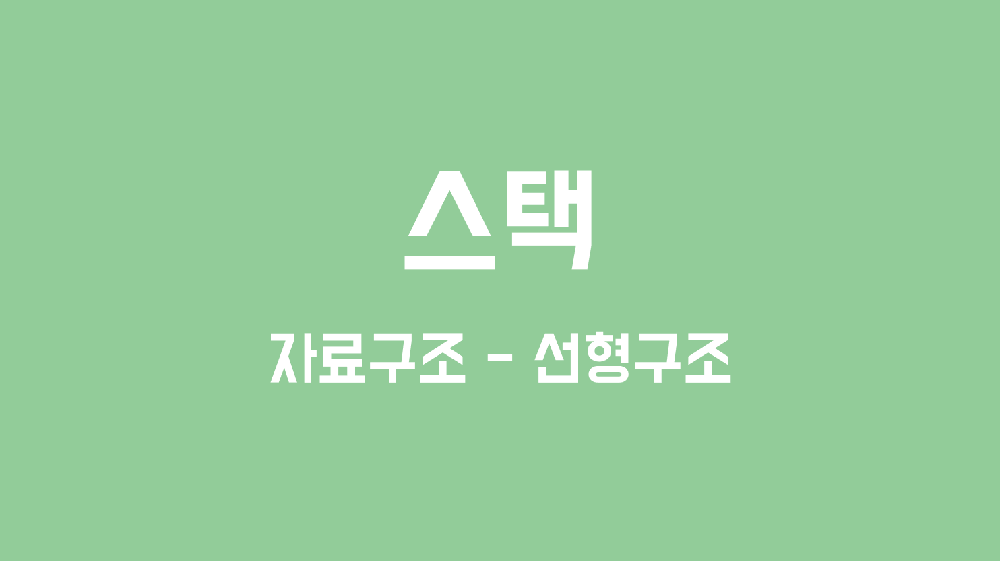
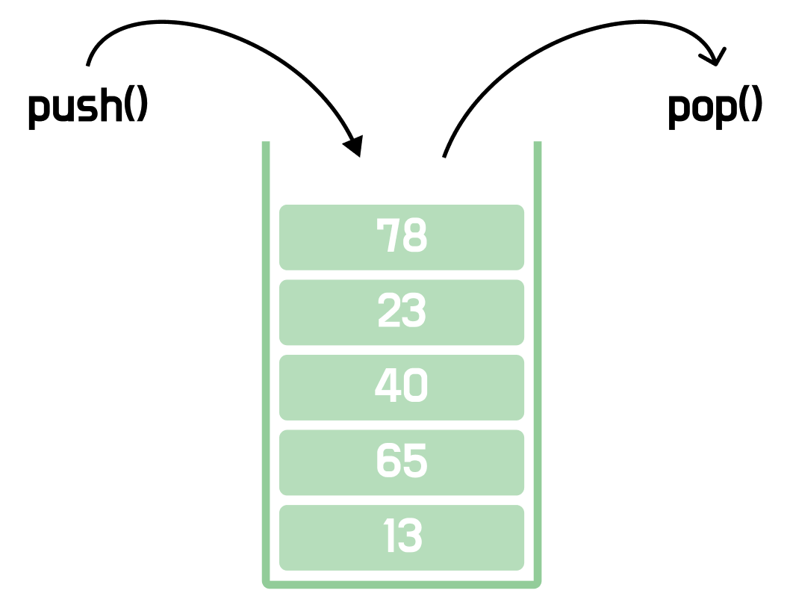
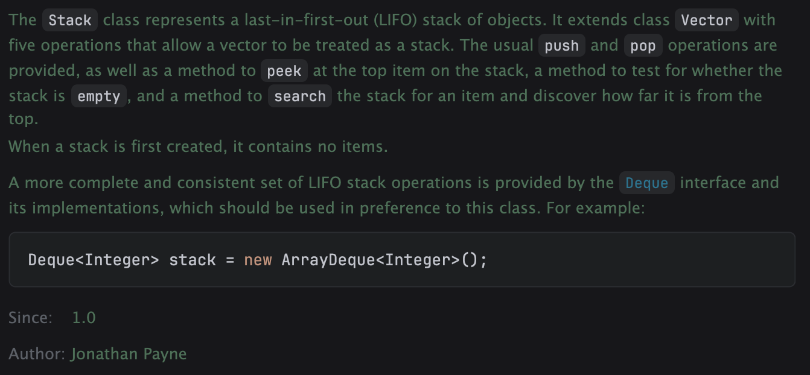

# 스택



> ***스택은 후입선출의 구조로 동작하는 자료구조이다.***

<br>

### 💡스택의 정의

**스택**(Stack)은 가장 나중에 들어온 원소가 가장 먼저 나가는 **후입선출**(LIFO, Last In First Out) 구조의 대표적인 자료구조이다. 웹 브라우저의 뒤로가기, 수식 검사 등 다양한 곳에서 활용된다.



<br>

### 💡스택의 생성

**Java**에서는 `Stack` 클래스를 제공하고 있고, 아래와 같이 생성하여 사용할 수 있다.

```java
public static void main(String[] args) {
    Stack<Integer> stack = new Stack<>();

    stack.push(1);
    stack.push(2);
    stack.push(3);

    // stack = [1, 2, 3]
    System.out.println("stack = " + stack);

    /**
     * element = 3
     * element = 2
     * element = 1
     */
    for(int i = 0; i < 3; i++){
        Integer element = stack.pop();
        System.out.println("element = " + element);
    }

    // stack = []
    System.out.println("stack = " + stack);
}
```

<br>

다만, 현재는 `Stack` 대신 `Deque` 사용을 권장한다. `Stack` 클래스는 내부적으로 `Vector`를 상속받아 구현되어 있는데, `Vector` 자체가 레거시 클래스로 분류되어 있고 설계상 여러 문제점이 존재하기 때문이다.



<br>

### 💡스택의 메서드

**기본 메서드(with Deque)**

```java
Deque<Integer> dequeStack = new ArrayDeque<>();

// 원소 삽입
dequeStack.push(1);
dequeStack.push(2);

// 원소 꺼내기
Integer e1 = dequeStack.pop();
Integer e2 = dequeStack.pop();

// 최상단 원소 확인
Integer e3 = dequeStack.peek();

// 비어있는지 확인
boolean empty = dequeStack.isEmpty();

// 원소 개수 확인
int size = dequeStack.size();

// 스택 비우기
dequeStack.clear();
```