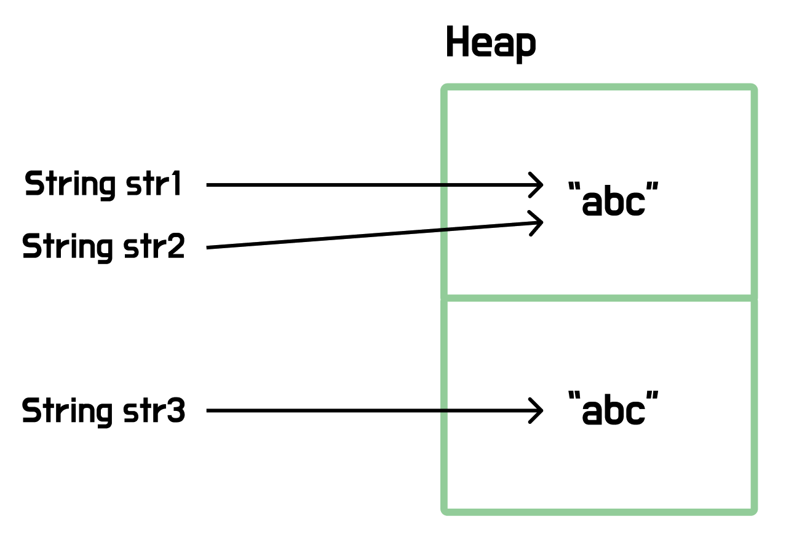

# 문자열


> ***문자열은 문자의 모음을 저장하는 자료구조이다.***

<br>

## 💡문자열 정의

**문자열**은 가장 기본적인 자료구조 중 하나로, **Java**에서는 원시 타입이 아닌 **참조 타입**으로 분류된다.

**Java**에서 `String`은 불변 객체로, 한 번 생성된 인스턴스의 값은 변경할 수 없다.

<br>

아래와 같은 문자열 연산이 가능하긴 하나, 이는 기존 객체에 값을 이어붙이는 것이 아니다. 내부적으로는 연결된 결과를 담은 새로운 `String` 객체를 생성하고, 변수가 해당 객체의 주소값을 참조하도록 갱신하는 것이다.

```java
String str = "Hello";
str = str + " World";
```

<br>

## 💡문자열 생성

문자열을 생성하는 방식에는 크게 두 가지가 있다. **첫번째**는 문자열 리터럴을 바로 할당하는 방식, **두번째**는 new 연산자를 이용하는 방식이다.

아래 두 비교 연산 결과를 보자

```java
public static void main(String[] args) {
    String str1 = "abc";
    String str2 = "abc";

    String str3 = new String("abc");

    System.out.println(str1 == str2); // true
    System.out.println(str1 == str3); // false
}
```

<br>

**String**은 참조타입인 것을 기억하자. 위 세 개의 문자열은 **Heap** 메모리 상에서 아래와 같이 저장된다.



**리터럴 방식**으로 문자열을 생성하면, **Heap** 내 `String Constant Pool` 영역에 적재되고, **new 키워드 방식**으로 생성하면 **Heap**의 일반 영역에 새 객체로 적재된다.

따라서, `==` 비교 연산에서 서로 다른 객체이기 때문에 `false`가 반환된 것이다. 만약, 값 비교를 의도할 것이라면 `equals()`를 사용하는 것이 바람직하다.

<br>

## 💡문자열메서드

**문자열 비교**

```java
// 문자열 값 비교
boolean equals = str1.equals(str2);

// 문자열 값 비교(대소문자 구분 X)
boolean equalsIgnoreCase = str1.equalsIgnoreCase(str2);

// 문자열 사전순 비교(같으면 0, 앞이면 음수, 뒤면 양수)
int compareTo = str1.compareTo(str2);
```

<br>

**검색과 확인**

```java
// 문자열 포함 여부 확인
boolean contains = str1.contains(str2);

// 시작 문자열 확인
boolean startsWith = str1.startsWith(str2);

// 종료 문자열 확인
boolean endsWith = str1.endsWith(str2);

// 첫번째 위치 반환
int indexOf = str1.indexOf(str2);

// 마지막 위치 반환
int lastIndexOf = str1.lastIndexOf(str2);
```

<br>

**추출**

```java
// 특정 인덱스 문자 조회
char charAt = str1.charAt(1);

// 부분 문자열 추출
String substring = str1.substring(0, 1);

// 구분자 기준 분할
String[] split = str1.split("-");
```

<br>

**변환**

```java
// 대문자 변환
String upperCase = str1.toUpperCase();

// 소문자 변환
String lowerCase = str1.toLowerCase();

// 양쪽 공백 제거
String trim = str1.trim();

// 문자열 치환
String replace = str1.replace("a", "x");

// 정규식 기반 치환
String replaceAll = str1.replaceAll("[0-9]", ""); // 숫자 제거
```

<br>

**결합과 생성**

```java
// 문자열 연결
String concat = str1.concat(str2);

// 구분자로 연결
String join = String.join(", ", "Apple", "Banana", "Cherry"); // "Apple, Banana, Cherry"

// 형식 지정 문자열 생성
String format = String.format("이름: %s, 나이: %d", "홍길동", 20); // "이름: 홍길동, 나이: 20"

// 문자열로 변환
String valueOf = String.valueOf(10);
```

<br>

**정보**

```java
// 문자열 길이
int length = str1.length();

// 길이 0 여부
boolean empty = str1.isEmpty();

// 공백만 존재하는지 여부
boolean blank = str1.isBlank();
```