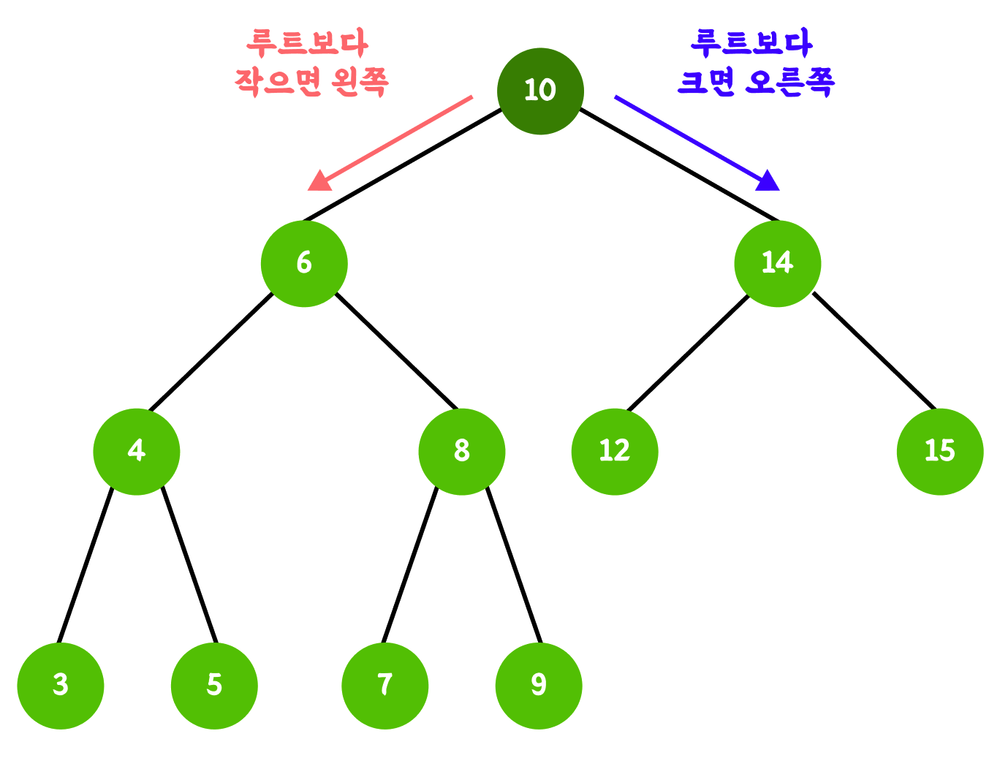
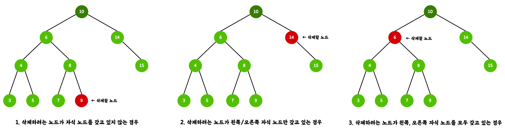
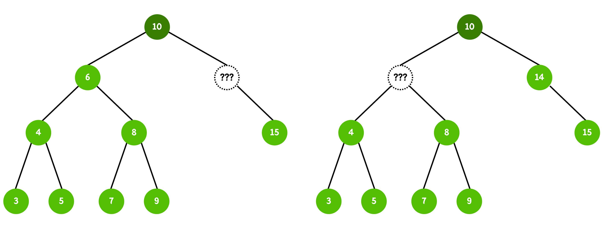
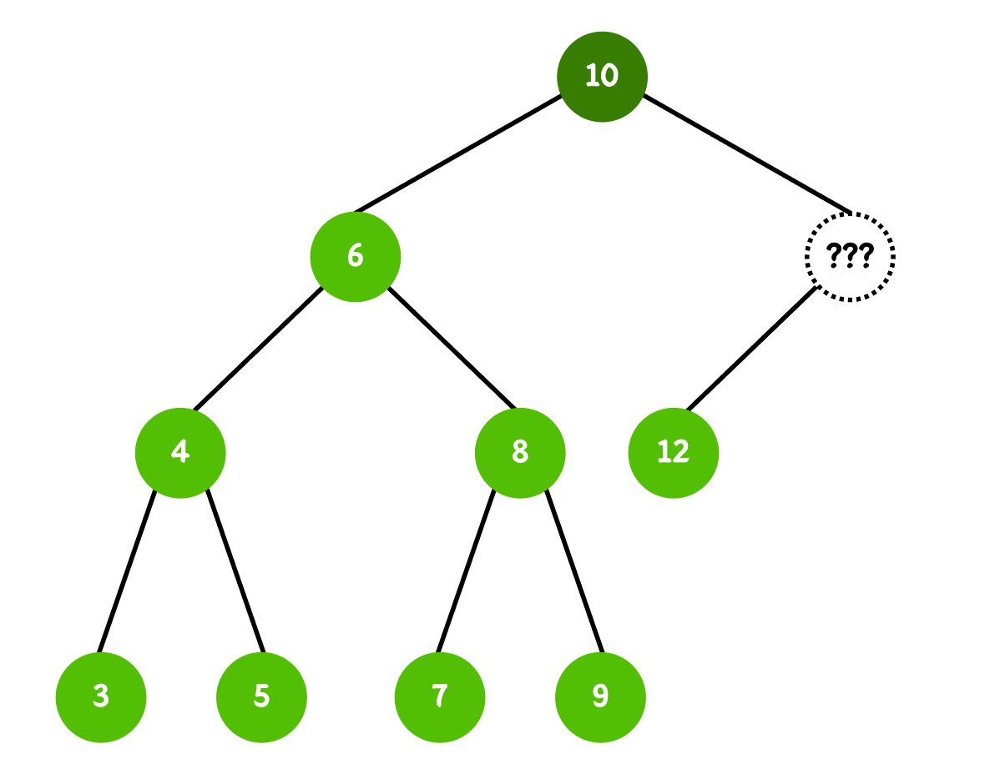
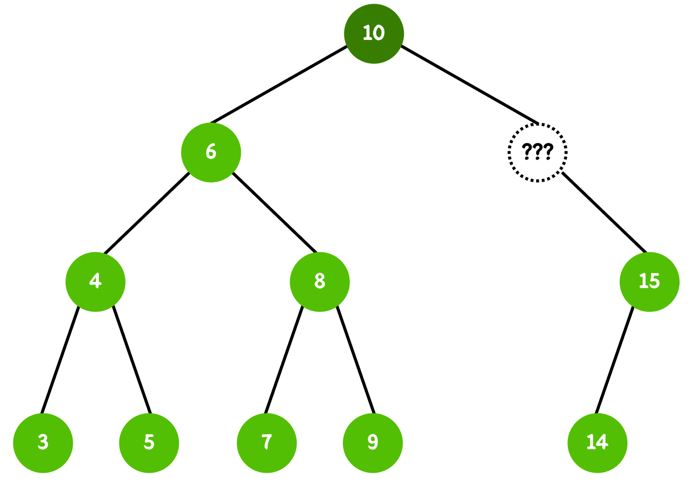
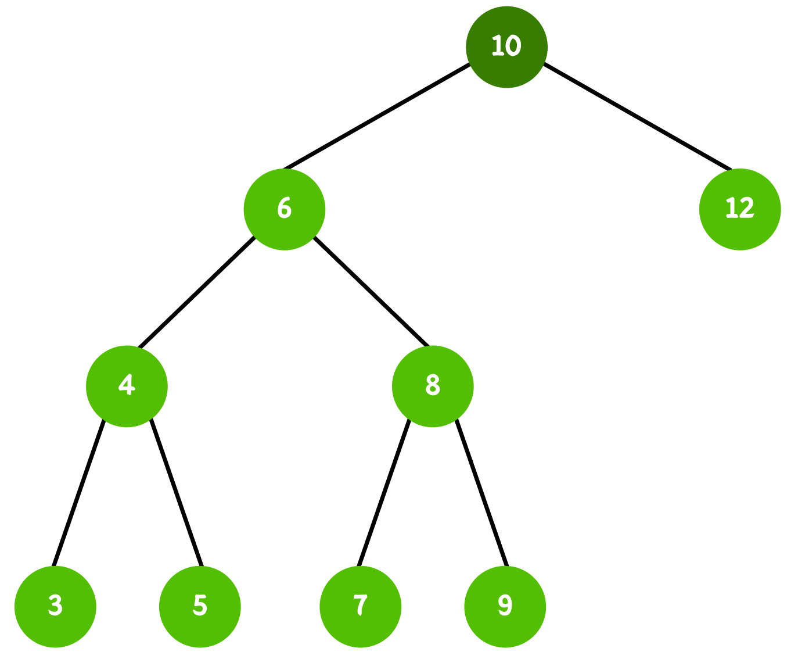
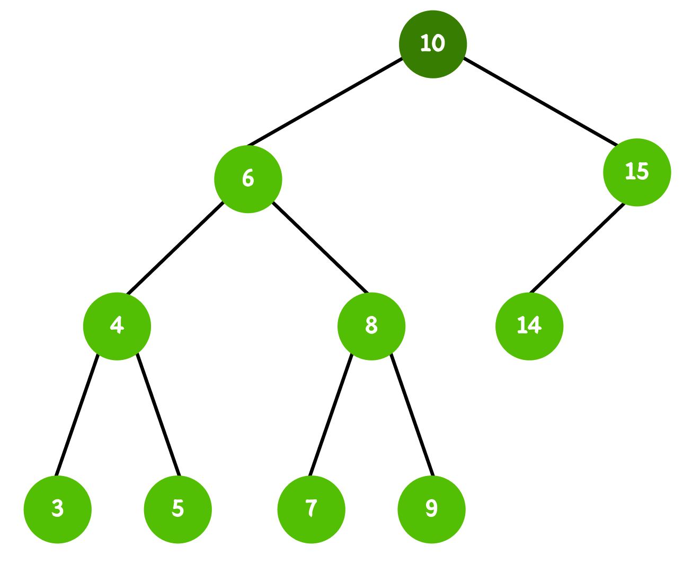
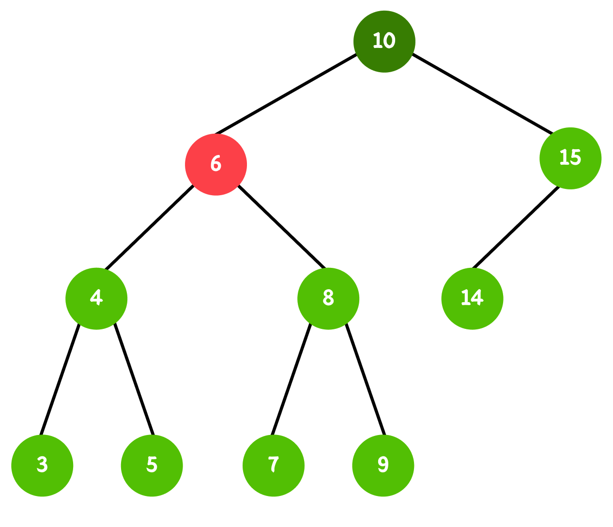
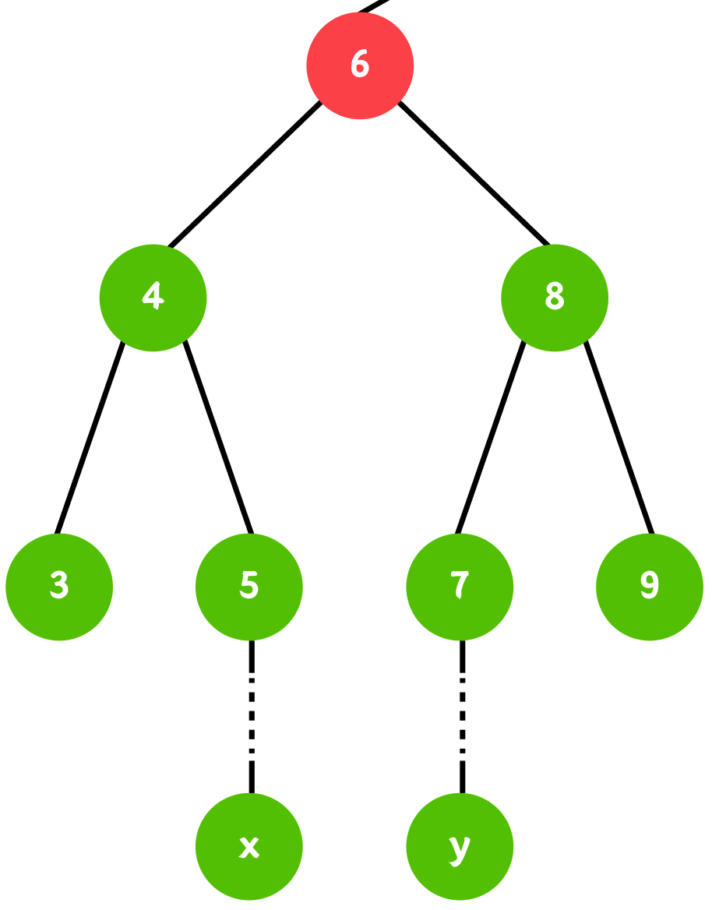

# 이진 탐색 트리


<br>

### 💡이진 탐색 트리의 정의



**이진 탐색 트리**란, 탐색을 위해 설계된 트리 구조로 아래 조건들을 만족한다.

- **왼쪽 서브트리**의 모든 값은 루트의 키값보다 작다.
- **오른쪽 서브트리**의 모든 값은 루트의 키값보다 크다.
- 왼쪽 서브트리와 오른쪽 서브트리 모두 이진탐색트리 조건을 만족한다.
- 중복 노드를 허용하지 않는다.

<br>

### 💡이진 탐색 트리의 생성

가장 기본적인 **BST** 형태로 구현하였다. 이진 탐색 트리의 메서드 파트에서 메서드를 직접 구현해보도록 하자.

```java
public static void main(String[] args) {
    Node root = new Node(10);

    BinarySearchTree bst = new BinarySearchTree(root);
}

static class Node{
    int data;
    Node left;
    Node right;

    public Node(Integer data){
        this.data = data;
        this.left = null;
        this.right = null;
    }
}

static class BinarySearchTree{
    Node root;
    int size;

    public BinarySearchTree(Node root){
        this.root = root;
        this.size = 1;
    }
}
```

<br>

### 💡이진 탐색 트리의 메서드

#### ⚙️ add()

```java
public void add(Node node){
		// 루트 노드부터 시작해, 데이터의 대소를 비교하여 적절한 위치에 삽입한다.
		
		// 트리가 비어있으면 루트로 삽입
		if(this.root == null){
		    this.root = node;
		    this.size++;
		    return;
		}
		
		Node currentNode = this.root;
		
		do{
		    if(node.data == currentNode.data){
		        // 십입 데이터와 같으면 종료(중복 허용 X)
		        return;
		    } else if (node.data < currentNode.data) {
		        // 삽입 데이터가 작으면
		        // 삽입하려는 곳에 노드가 없으면 노드를 삽입하고 종료
		        if(currentNode.left == null){
		            currentNode.left = node;
		            this.size++;
		            return;
		        }
		
		        // 삽입하려는 곳에 노드가 있으면 다음 노드로 이동
		        currentNode = currentNode.left;
		    }else{
		        // 삽입 데이터가 크면
		        // 삽입하려는 곳에 노드가 없으면 노드를 삽입하고 종료
		        if(currentNode.right == null){
		            currentNode.right = node;
		            this.size++;
		            return;
		        }
		
		        // 삽입하려는 곳에 노드가 있으면 다음 노드로 이동
		        currentNode = currentNode.right;
		    }
		}while(true);
}
```

<br>

#### ⚙️ remove()

삽입과 다르게 삭제는 고려해야 할 케이스가 조금 많다.

1. 삭제하려는 노드가 자식 노드를 갖고 있지 않는 경우
2. 삭제하려는 노드가 왼쪽/오른쪽 자식 노드만 갖고 있는 경우
3. 삭제하려는 노드가 왼쪽, 오른쪽 자식 노드를 모두 갖고 있는 경우

<br>

그리고 그 케이스를 그림으로 보면 아래와 같다.



1번 경우에는 노드를 삭제한 후 바로 종료가 되지만, 2번과 3번 같은 경우에는 삭제 후에도 이진 트리의 형태를 유지할 수 있도록 추가적인 연산이 필요하다.



<br>

그 전에 1번 경우 인지, 2번 경우인지, 3번 경우인지 구분하는 로직이 필요하다.

각 경우에 맞게 삭제 로직을 처리할 수 있도록, 자식 노드를 0개, 1개, 2개 갖고있는지 판별하는 로직을 작성했다.

```java
public NodeType findNodeType(Node node){
    if (node.left != null && node.right != null) {
		    // 자식 노드가 2개인 경우
        return NodeType.TWO_CHILD;
    } else if (node.left != null || node.right != null) {
		    // 자식 노드가 1개인 경우
        return NodeType.ONE_CHILD;
    } else {
		    // 자식 노드가 0개인 경우
        return NodeType.NO_CHILD;
    }
}

enum NodeType{
    TWO_CHILD,
    ONE_CHILD,
    NO_CHILD
}
```

<br>

#### 1. 자식 노드가 0개인 경우

```java
public void remove(int target){
    Node parentNode = findParentNode(target);
    Node targetNode = findTargetNode(target);

    NodeType type = findNodeType(targetNode);
    boolean isRoot = (parentNode == null);

    switch (type){
        case NO_CHILD:
            if(isRoot){
                this.root = null;
                break;
            }else{
                if(parentNode.left == targetNode){
                    parentNode.left = null;
                }else{
                    parentNode.right = null;
                }
                break;
            }
        case ONE_CHILD:
        case TWO_CHILD:
    }
}

public Node findTargetNode(int target){
    Node currentNode = this.root;

    while(currentNode != null){
        if (currentNode.data == target){
            return currentNode;
        }

        if(target < currentNode.data){
            currentNode = currentNode.left;
        }else{
            currentNode = currentNode.right;
        }
    }
    return null;
}

public Node findParentNode(int target){
    Node currentNode = this.root;

    while(currentNode != null){
        if(currentNode.left.data == target
            || currentNode.right.data == target
        ){
            return currentNode;
        }

        if(target < currentNode.data){
            currentNode = currentNode.left;
        }else{
            currentNode = currentNode.right;
        }
    }
    return null;
}
```


편의상 삭제하려는 노드를 찾는 메서드, 그의 부모 노드를 찾는 메서드를 추가하였다.

삭제하려는 노드의 자식이 없는 경우이므로, 추가적인 로직은 필요하지 않다.

<br>

#### 2-1. 자식 노드가 1개이며, 왼쪽 자식인 경우



이 경우 10을 12로 연결해주면 된다.



#### 2-2. 자식 노드가 1개이며, 오른쪽 자식인 경우



이 경우 10을 15로 연결해주면 된다.



코드로 구현하면

```java
switch (type){
    case NO_CHILD:
    case ONE_CHILD:
        Node newChildNode = targetNode.left != null ? targetNode.left : targetNode.right;

        if(parentNode.left == targetNode){
            parentNode.left = newChildNode;
        }else{
            parentNode.right = newChildNode;
        }
        break;
    case TWO_CHILD:
}
```

<br>

#### 3. 자식 노드가 2개인 경우



예를 들어, 노드 6을 삭제하는 경우, 왼쪽 서브트리 최솟값인 3 또는 오른쪽 서브트리 최댓값인 9로 대체하면, 해당 노드가 루트 자리로 올라가는 순간 나머지 서브트리와의 대소 관계가 깨져 성질을 위반하게 된다.

<br>

반면, **왼쪽 서브트리의 최댓값**(중위 전임자)와 **오른쪽 서브트리의 최솟값**(중위 후계자)는 대체 후에도 기존 성질을 유지할 수 있는 유일한 두 후보이다.



위 그림에서의 x 또는 y를 찾아 연결해주면 된다. 코드로 구현하면,

```java
switch (type){
    case NO_CHILD:
    case ONE_CHILD:
    case TWO_CHILD:
        // 오른쪽 서브트리의 최솟값(중위 후계자)을 찾는다
        Node successor = targetNode.right;
        while (successor.left != null) {
            successor = successor.left;
        }

        // 후계자 값을 저장 후, 후계자 노드를 먼저 삭제한다 (후계자는 NO_CHILD 또는 ONE_CHILD)
        int successorData = successor.data;
        remove(successorData);

        // 삭제 대상 노드의 값을 후계자 값으로 교체한다
        targetNode.data = successorData;
        break;
}
```

<br>

**최종 코드(삭제하려는 노드가 루트인 경우 분기 처리 추가)**

```java
public void remove(int target){
    Node parentNode = findParentNode(target);
    Node targetNode = findTargetNode(target);

    NodeType type = findNodeType(targetNode);
    boolean isRoot = (parentNode == null);

    switch (type){
        case NO_CHILD:
            if(isRoot){
                this.root = null;
                break;
            }else{
                if(parentNode.left == targetNode){
                    parentNode.left = null;
                }else{
                    parentNode.right = null;
                }
                break;
            }
        case ONE_CHILD:
            if(isRoot){
                this.root = (this.root.left != null) ? this.root.left : this.root.right;
                break;
            }else{
                Node newChildNode = targetNode.left != null ? targetNode.left : targetNode.right;

                if(parentNode.left == targetNode){
                    parentNode.left = newChildNode;
                }else{
                    parentNode.right = newChildNode;
                }
                break;
            }
        case TWO_CHILD:
            // 오른쪽 서브트리의 최솟값(중위 후계자)을 찾는다
            Node successor = targetNode.right;
            while (successor.left != null) {
                successor = successor.left;
            }

            // 후계자 값을 저장 후, 후계자 노드를 먼저 삭제한다 (후계자는 NO_CHILD 또는 ONE_CHILD)
            int successorData = successor.data;
            remove(successorData);

            // 삭제 대상 노드의 값을 후계자 값으로 교체한다
            targetNode.data = successorData;
            break;
    }
}

public Node findTargetNode(int target){
    Node currentNode = this.root;

    while(currentNode != null){
        if (currentNode.data == target){
            return currentNode;
        }

        if(target < currentNode.data){
            currentNode = currentNode.left;
        }else{
            currentNode = currentNode.right;
        }
    }
    return null;
}

public Node findParentNode(int target){
    Node currentNode = this.root;

    while(currentNode != null){
        if(currentNode.left.data == target
            || currentNode.right.data == target
        ){
            return currentNode;
        }

        if(target < currentNode.data){
            currentNode = currentNode.left;
        }else{
            currentNode = currentNode.right;
        }
    }
    return null;
}

public NodeType findNodeType(Node node){
    if (node.left != null && node.right != null) {
        return NodeType.TWO_CHILD;
    } else if (node.left != null || node.right != null) {
        return NodeType.ONE_CHILD;
    } else {
        return NodeType.NO_CHILD;
    }
}

enum NodeType{
    TWO_CHILD,
    ONE_CHILD,
    NO_CHILD
}
```