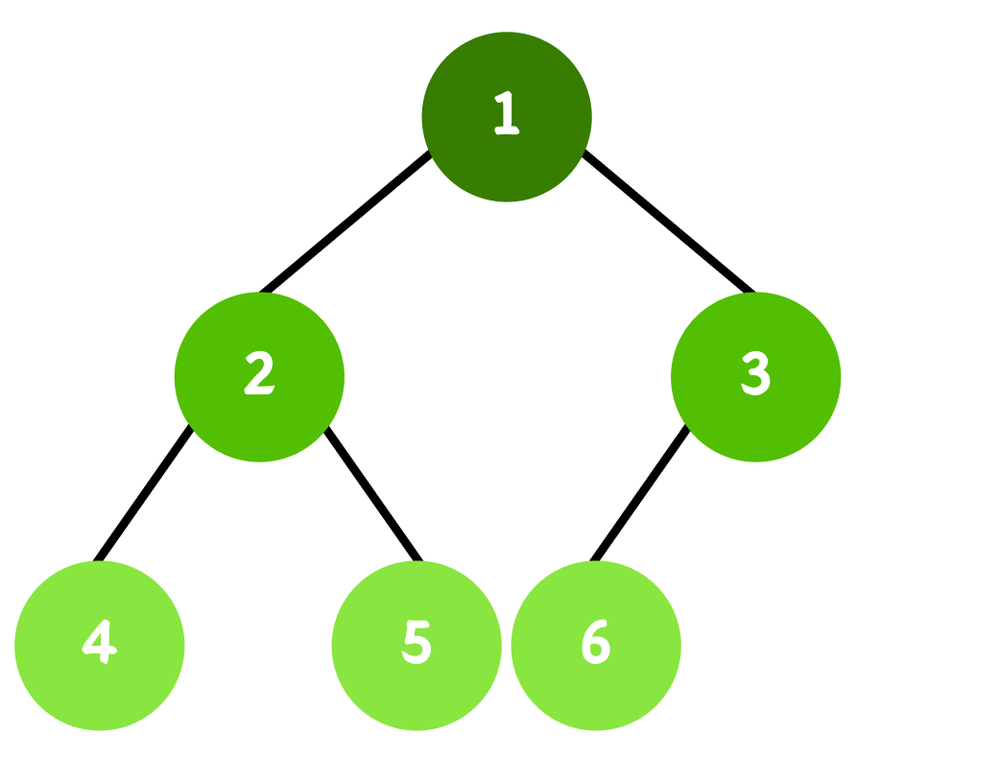
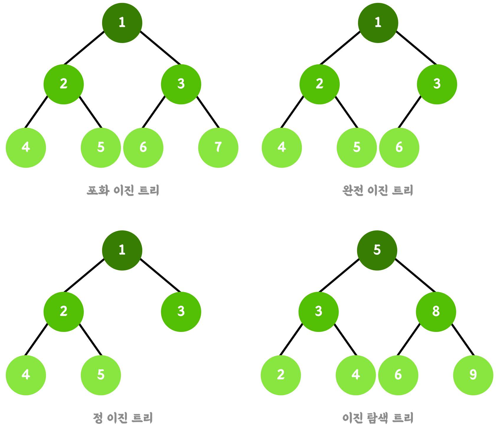

# 이진트리


### 💡 이진 트리의 정의

**이진 트리**는 각 노드가 최대 두 개의 자식 노드를 가질 수 있는 계층적 자료구조이다. 트리의 최상위 노드를 **루트노드**라고 하며, 자식이 없는 노드를 **리프노드**라고 한다.



주요 변형은 아래와 같다.

- **포화 이진 트리**(Perfect Binary Tree)

  → 모든 내부 노드가 2개의 자식을 가지며, 모든 리프가 같은 레벨에 위치한 트리

- **완전 이진 트리**(Complete Binary Tree)

  → 마지막 레벨을 제외한 모든 레벨이 채워져 있고, 마지막 레벨은 왼쪽부터 채워지는 트리

- **정 이진 트리**(Full Binary Tree)

  → 모든 노드가 0개 또는 2개의 자식을 가지는 트리

- **이진 탐색 트리**(Binary Search Tree)

  → 왼쪽 서브트리의 모든 값 < 부모 < 오른쪽 서브트리의 모든 값을 만족하는 트리




### 💡 이진 트리의 생성

```java
public static void main(String[] args) {
    TreeNode root = new TreeNode(1);
    TreeNode n1 = new TreeNode(2);
    TreeNode n2 = new TreeNode(3);

    root.leftNode = n1;
    root.rightNode = n2;

    root.leftNode.leftNode = new  TreeNode(4);
    root.leftNode.rightNode = new  TreeNode(5);

    //        1
    //       / \
    //      2   3
    //     / \
    //    4   5
}

static class TreeNode{
    int val;
    TreeNode leftNode;
    TreeNode rightNode;

    TreeNode(int val){
        this.val = val;
        this.leftNode = null;
        this.rightNode = null;
    }
}
```

### 💡 이진 트리의 순회

이진 트리는 대표적으로 4가지의 순회 방식이 있다.

- **전위순회**(Pre-order)

  루트 → 왼쪽 → 오른쪽 순으로 순회

- **중위순회**(In-order)

  왼쪽 → 루트 → 오른쪽 순으로 순회

- **후위순회**(Post-order)

  왼쪽 → 오른쪽 → 루트 순으로 순회

- **레벨순회**(Level-order)

  레벨순으로 내려가며 순회(**BFS**)


**재귀함수**를 통해 간단하게 구현할 수 있다.

```java
public void preOrder(TreeNode root){
    if (root == null)
        return;

    System.out.print(root.val);
    preOrder(root.leftNode);
    preOrder(root.rightNode);
}

public void inOrder(TreeNode root){
    if (root == null)
        return;

    inOrder(root.leftNode);
    System.out.print(root.val);
    inOrder(root.rightNode);
}

public void postOrder(TreeNode root){
    if (root == null)
        return;
    postOrder(root.leftNode);
    postOrder(root.rightNode);
    System.out.print(root.val);
}

public void levelOrder(TreeNode root){
    if (root == null)
        return;

    Queue<TreeNode> queue = new LinkedList<>();
    queue.add(root);
    while (!queue.isEmpty()){
        TreeNode node = queue.poll();
        System.out.print(node.val);
        if (node.leftNode != null)
            queue.add(node.leftNode);
        if (node.rightNode != null)
            queue.add(node.rightNode);
    }
}
```

❗️일반 이진 트리는 구조 보장이 없어, 최악의 경우 **편향 트리**가 되어 **O(n)**이 된다. 균형을 유지하는 **BST**(AVL, Red-Black Tree 등)을 사용하면 **O(log N)**을 보장할 수 있다.