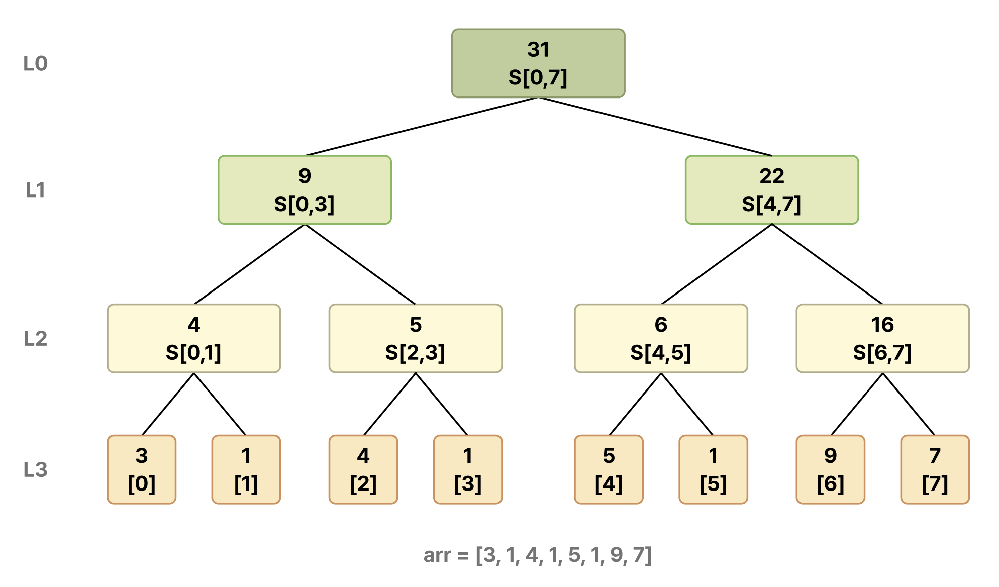

# 세그먼트 트리


<br>

### 📌누적합(Prefix Sum)

누적합은 배열의 구간 합을 빠르게 구하는 전처리 기법이다.

$$
prefix[i] = arr[0] + arr[1] + … + arr[i]
$$

이 누적합을 미리 계산해두면, **`[l, r]`** 구간의 합을 다음과 같이 O(1)에 구할 수 있다.

$$
S[l, r] = prefix[r+1] - prefix[l]
$$

<br>

```java
public static void main(String[] args) {
    int[] arr = {3, 1, 4, 1, 5, 9, 2, 6};
    int length = arr.length;

    // 전처리 O(n)
    int[] prefix = new int[length+1];
    for(int i = 0; i < length; i++){
        prefix[i+1] =  prefix[i] + arr[i];
    }
}

// 구간합 O(1)
public int rangeSum(int[] prefix, int l, int r){
    return prefix[r] - prefix[l];
}
```

하지만, 배열의 값이 수시로 변경되면, 매번 전처리를 다시 해야 하므로 O(n)의 비용이 발생한다. 이를 개선한 트리가 **세그먼트 트리**이다.

<br>

### 📌세그먼트 트리의 정의



세그먼트 트리는 완전 이진 트리 구조로, 다음과 같은 특성을 가진다.

- **리프 노드**는 **배열의 각 원소**이다.
- **내부 노드**는 자식 노드들의 **구간 합**이다.
- **루트 노드**는 **배열 각 원소의 총합**이다.

누적합 대비, 업데이트에 있어서 O(log N) 비용으로 절감된다.

<br>

### 📌세그먼트 트리의 구현

배열 인덱스로 트리를 표현한다. 노드 `k`의 왼쪽 자식은 `2k`, 오른쪽 자식은 `2k+1`이다.

```java
static class SegmentTree{
    static int[] arr;
    static long[] tree;

    static void build(int node, int start, int end){
        // 리프노드인 경우
        if(start == end){
            tree[node] = arr[start];
            return;
        }

        // 내부노드인 경우
        int mid = (start + end)/2;

        // 왼쪽 자식과 오른쪽 자식을 재귀적으로 호출
        build(2*node, start, mid);
        build(2*node+1, mid + 1, end);

        tree[node] = tree[2 * node] + tree[2 * node + 1];
    }
```

<br>

### 📌구간 합 구하기

쿼리 구간`[l, r]`과 현재 노드의 구간 `[start, end]`의 관계는 3가지 케이스만 존재한다.

- 현재 노드가 나타내는 구간이 **완전히 겹치**는 경우
- 현재 노드가 나타내는 구간이 **일부만 겹치는** 경우
- 현재 노드가 나타내는 구간이 **완전히 안겹치는** 경우

```java
static long query(int node, int start, int end, int l, int r){
    // 현재 노드가 나타내는 구간이 완전히 안겹치는 경우
    if(r < start || l > end)
        return 0;

    // 현재 노드가 나타내는 구간이 완전히 겹치는 경우
    if(l <= start && r >= end)
        return tree[node];

    // 현재 노드가 나타내는 구간이 일부만 겹치는 경우
    int mid =  (start + end)/2;
    return query(2*node, start, mid, l, r) + query(2*node + 1, mid+1, end, l, r);
}
```

구하려는 구간 `[l, r]`을 트리에 이미 저장된 **더 작은 구간들로 분해**하여, 해당 구간들의 합을 조합하는 방식이다.

<br>

`query(1,0,7,2,5)`는 아래 흐름으로 동작한다.

```
query(1, [0,7], [2,5])       → 부분 겹침, 분할
├── query(2, [0,3], [2,5])   → 부분 겹침, 분할
│   ├── query(4, [0,1], [2,5])   → 완전 이탈 → 0
│   └── query(5, [2,3], [2,5])   → 완전 포함 → tree[5] = 5  ✓
└── query(3, [4,7], [2,5])   → 부분 겹침, 분할
    ├── query(6, [4,5], [2,5])   → 완전 포함 → tree[6] = 6  ✓
    └── query(7, [6,7], [2,5])   → 완전 이탈 → 0

결과: 0 + 5 + 6 + 0 = 11
```

<br>

### 📌수 변경하기

변경 대상 **인덱스가 속하는 경로만** 타고 내려가 갱신한다.

```java
static void update(int node, int start, int end, int idx, int value){
    // 리프노드인 경우
    if(start == end){
        arr[idx] = value;
        tree[start] = value;
        return;
    }
    int mid = (start + end)/2;
    if(idx<=mid){
        // 왼쪽 자식의 서브트리에 있는 경우
        update(2*node, start, mid, idx, value);
    }else{
        // 오른쪽 자식의 서브트리에 있는 경우
        update(2*node+1, mid + 1, end, idx, value);
    }
    tree[node] = tree[2 * node] + tree[2 * node + 1];
}
```

`build`  메서드와 마찬가지로 **후위 순회 구조**이지만, `update`  메서드는 변경 대상 인덱스 `idx`가 속한 방향으로만 분기하여 내려가고, 복귀하면서 경로상의 부모 노드들을 재계산한다.

<br>

`update(1, 0, 7, 2, 10)`는 아래 흐름으로 동작한다.

```
update(1, [0,7], idx=2, val=10)    → 오른쪽? No, mid=3, idx=2 ≤ 3 → 왼쪽
└── update(2, [0,3], idx=2, val=10) → mid=1, idx=2 > 1 → 오른쪽
    └── update(5, [2,3], idx=2, val=10) → mid=2, idx=2 ≤ 2 → 왼쪽
        └── update(10, [2,2], idx=2, val=10) → 리프 도달
                tree[10] = 10  ✓

복귀하며 갱신:
  tree[5]  = tree[10] + tree[11] = 10 + 1 = 11  ✓
  tree[2]  = tree[4]  + tree[5]  = 4  + 11 = 15  ✓
  tree[1]  = tree[2]  + tree[3]  = 15 + 22 = 37  ✓
```